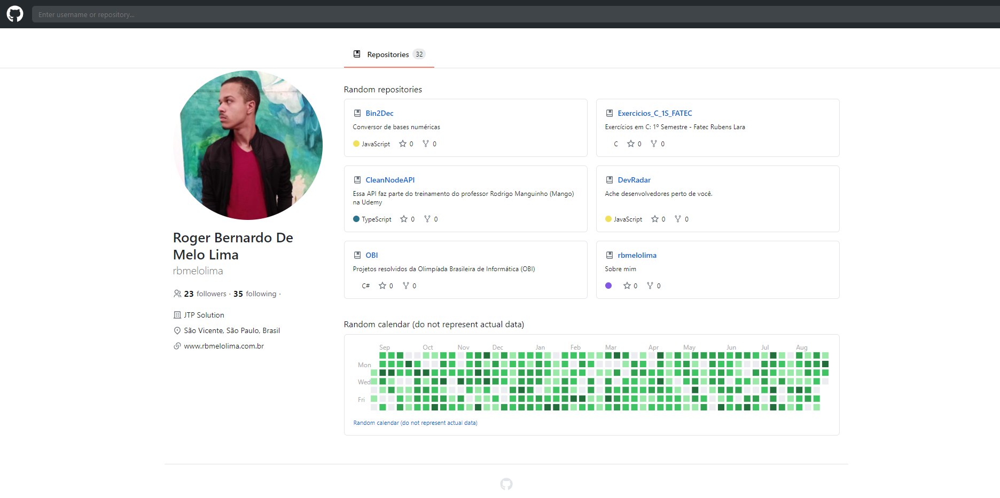
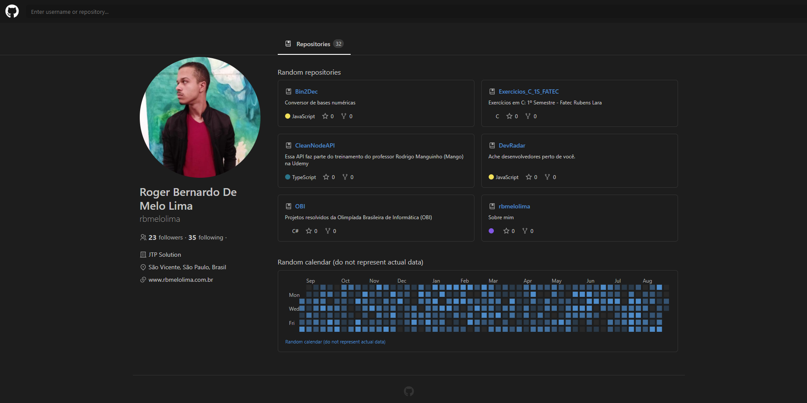
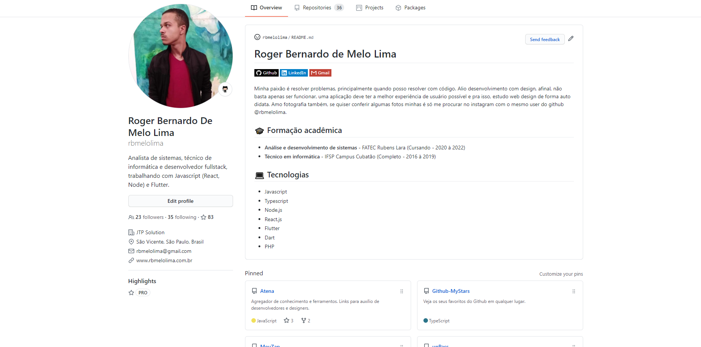

## :page_facing_up: Sobre
O objetivo deste projeto foi replicar a página inicial do Github, consumindo a API fornecido por eles para obter os dados dos usuários de forma dinâmica e atualizada.

## :camera: Preview

### Página da aplicação


### Página da aplicação - Modo Escuro


### Pagina de usuário do Github


## :hammer: Instalação
```bash
# Clone este repositório
$ git clone https://github.com/rbmelolima/UI-Clone-Github

# Entre na pasta raiz
$ cd UI-Clone-Github

# Instale as dependências com npm ou yarn
$ npm i

# Inicie a aplicação
$ npm run start
```

## :computer: Tecnologias
- [React](https://pt-br.reactjs.org/)
- [Typescript](https://pt-br.reactjs.org/)
- [date-fns](https://date-fns.org/)
- [react-calendar-heatmap](https://www.npmjs.com/package/react-calendar-heatmap)
- [react-icons](https://react-icons.github.io/react-icons/)
- [react-router-dom](https://reactrouter.com/web/guides/quick-start)
- [styled-components](https://styled-components.com/)


## :white_check_mark: Features
- [x] Replica da página de usuário do Github
- [x] Consumo de dados da API do Github
- [x] Navegação entre rotas
- [x] Pesquisa de usuários

## :construction: Próximas features
- [ ] Utiliza a API do Github em Graphql
- [ ] Utilizar SWR
 
## :link: Referências
[Recriando interface do Github com ReactJS | UI Clone](https://www.youtube.com/watch?v=iLEbGQXsg3k)